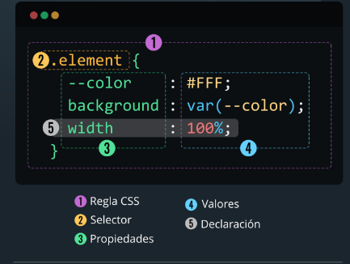

##  INTRODUCCION A CSS

# VINCULACION HTML - CSS
1. Hoja de estilo externa usando etiqueta "link"
```html
<link rel="stylesheet" href="style.css">
```
2. Usando la etiqueta "style"
```html
<style>
    h1{
        color: red;
    }
</style>
```
3. De manera inline en el elemento con el atributo "style"
```html
<h1 style="color: red">Titulo</h1>
```

# REGLA DE CSS
